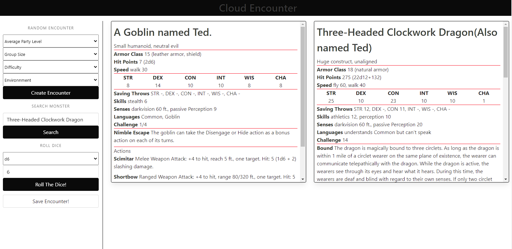
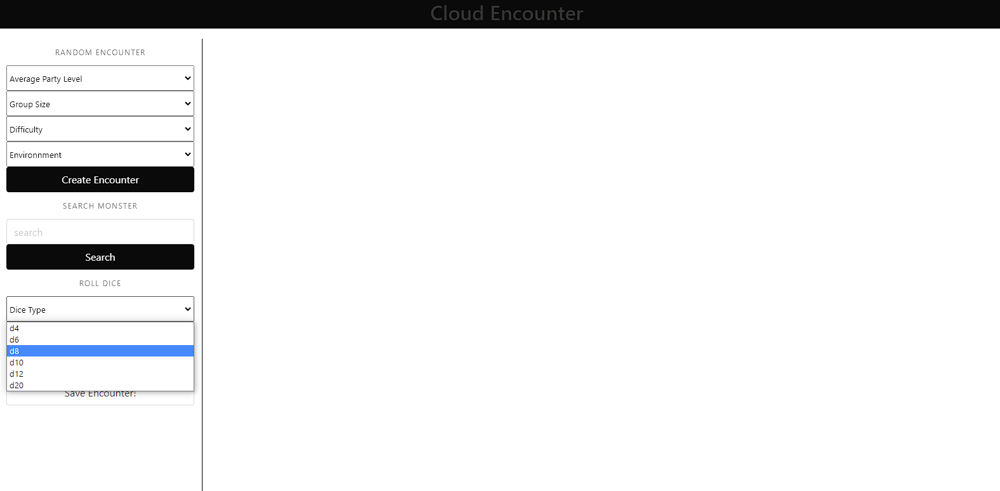
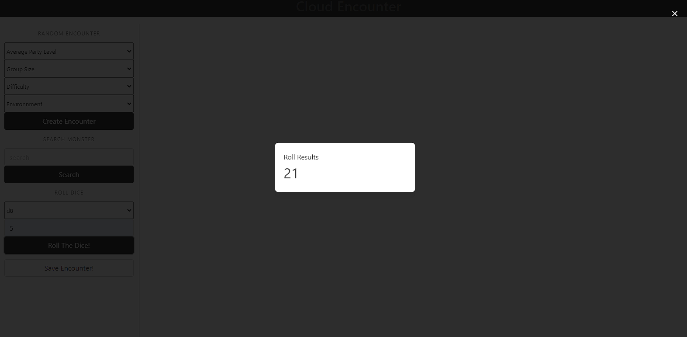

# Cloud Encounter

## Table of Contents

*[What](#What)

*[Screenshots](#Screenshots)

*[What We Learned](#What-we-learned)

*[Link](#Link)

## What
Welcome to Cloud Encounter! Your one stop shop for encounter planning and customization!
Our site uses html, css, and javascript. Through the use of jquery(js) and bulma cssframework)
styling and selecting elements has been made simple. Our Roll the dice functionality is powered
by Rollz api. 

## Screenshots

## What We Learned

Time management and teamwork will make the dream work.

## Link

https://benhuf.github.io/encounter-gen/